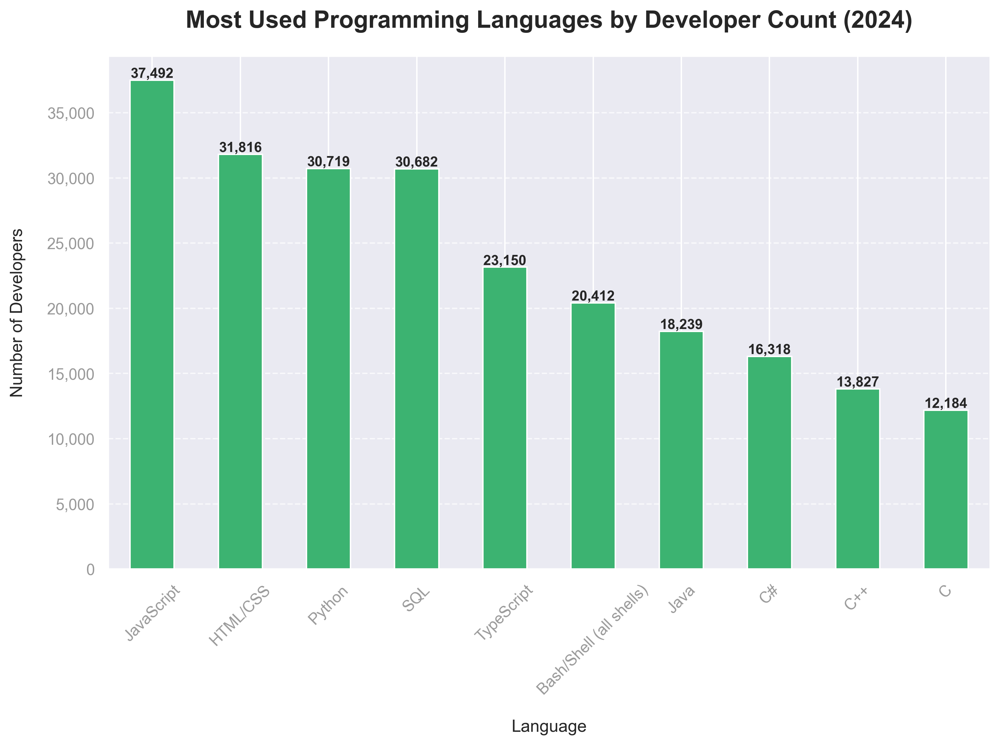
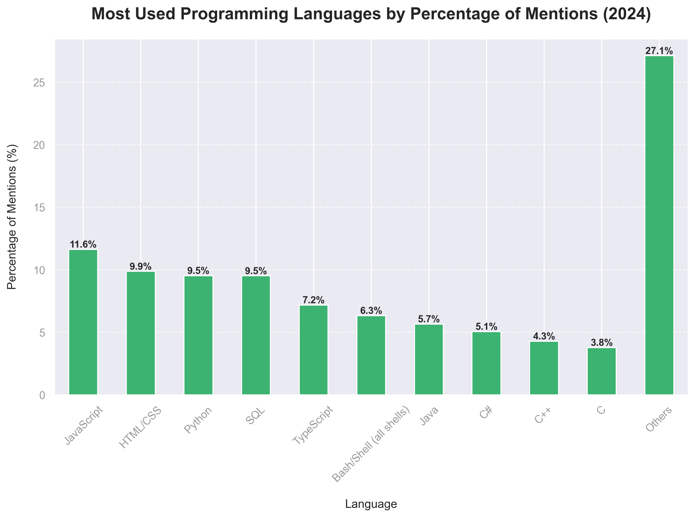
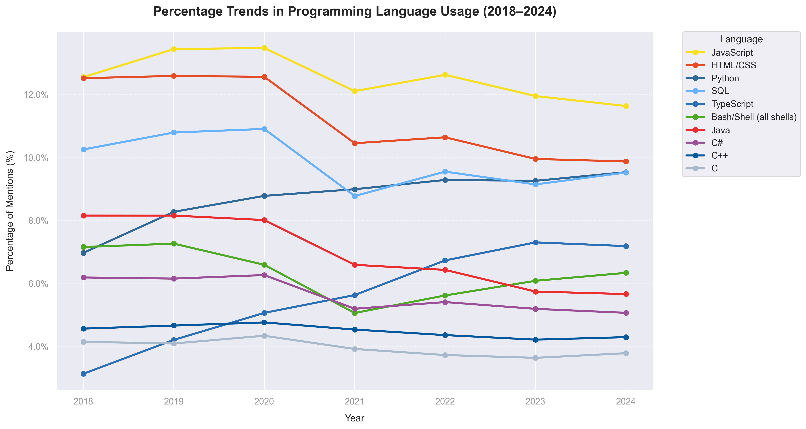
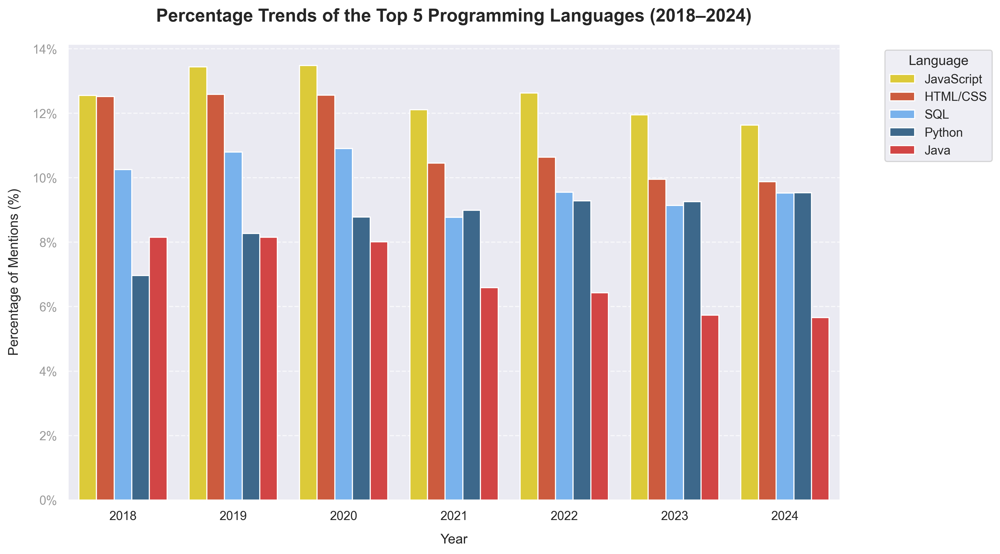
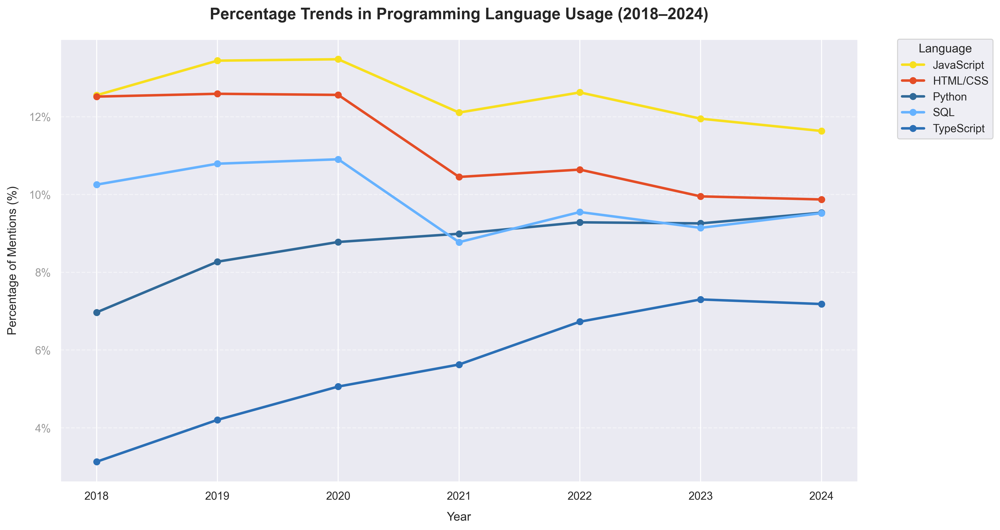
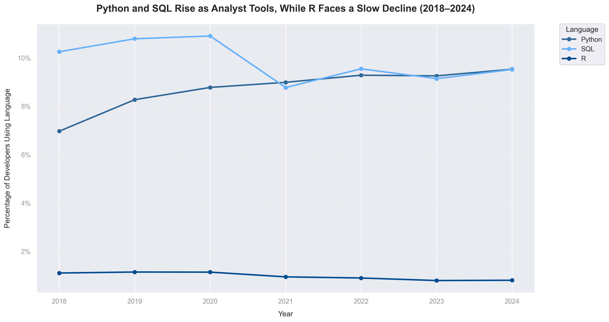
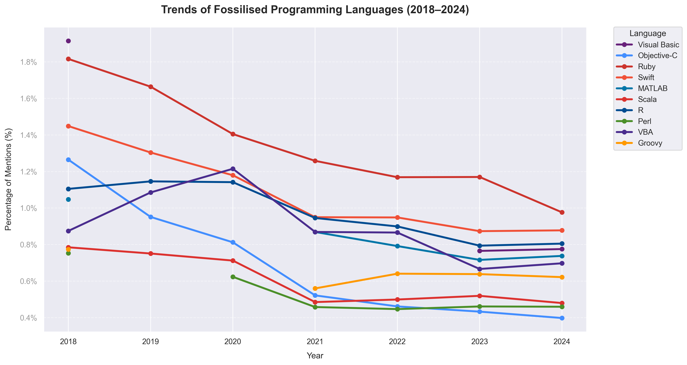
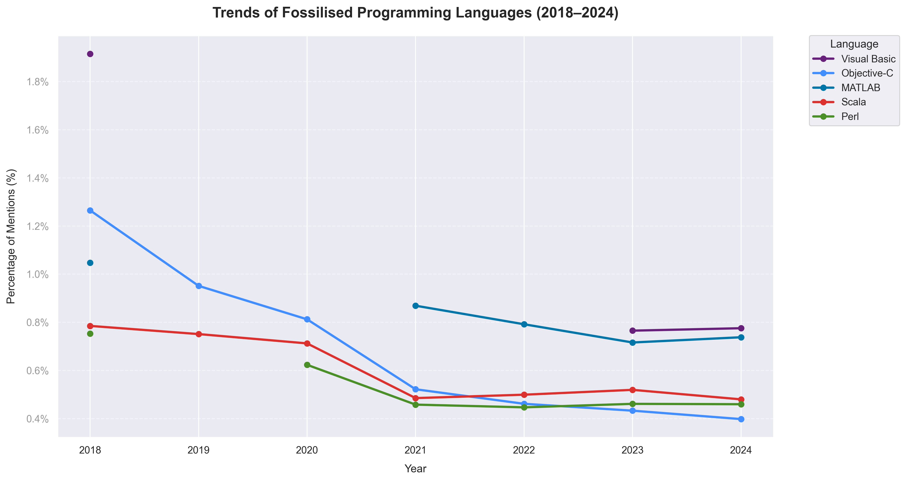
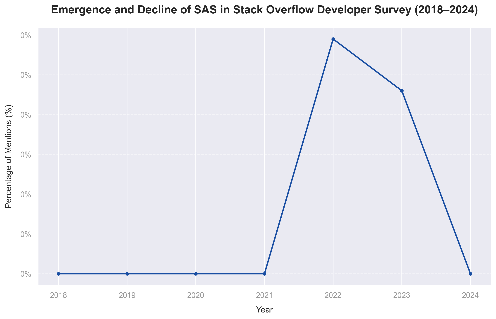

#### Setting


```python
from IPython.display import display, Image
```

# 1. Executive Summary

This analysis explores how programming language usage has evolved over the last seven years, based on developer responses from the **Stack Overflow Annual Survey (2018–2024)**. By examining both **usage counts** and **percentage mentions**, the project aims to uncover macro trends across the ecosystem—highlighting which languages are **gaining traction**, which are **stabilising**, and which are in **decline**.

### **Core Objectives**
- **Identify** the top programming languages used each year  
- **Detect** emerging and *“fossilised”* languages (i.e., those rising or fading in relevance)  
- **Evaluate** the long-term stability or volatility of language preferences  
- **Contextualise** these trends for real-world analytics and tooling decisions  

---

Notably, the **SAS anomaly** reveals a compelling micro-trend: a sudden emergence in **2022**, followed by an immediate drop in **2024**. This pattern aligns with broader conversations around industry demand for **enterprise-grade analytics**, and reflects my own exposure to SAS during an **exchange programme** in 2023. It serves as a reminder that niche tools can briefly surface when driven by institutional or curriculum shifts.

This project was both an **analytical exercise** and a **visual storytelling challenge**—intended to sharpen my exploratory data skills while demonstrating the ability to synthesise multi-year trends into **actionable insights**.

Each chart includes a **dedicated commentary**, and **colour consistency** is maintained across all visuals to ensure clarity, cohesion, and ease of interpretation.


# 2. Chart-by-Chart Insight Breakdown

## a. Most Used in 2024 (by Count & Percentage)

<div style="display: flex; justify-content: space-around; gap: 40px;">
    
    
</div>

**JavaScript** continues to dominate as the most widely used programming language in 2024, both by **developer count** and **percentage of mentions**, reinforcing its central role in **full-stack** and **frontend development**. **HTML/CSS** and **Python** follow closely, demonstrating their persistent relevance in **web development** and **data science**, respectively.  

Interestingly, while **SQL** and **Python** are nearly tied by count, SQL’s slightly higher percentage highlights its **ubiquitous presence in data infrastructure** and **platform integration** across industries.

Notably, the **"Others"** category leads in percentage mentions, suggesting a **long tail of niche or emerging tools** that—while individually smaller—**collectively hold a significant footprint**. This dispersion hints at an increasingly **diverse language landscape**, as developers explore **specialised or purpose-built tools** beyond the traditional top ten.

---

## b. Trends Across All Languages (2018–2024)

<div style="display: flex; justify-content: space-around; gap: 40px;">
  
</div>

**Interpretation**  
This chart provides a holistic view of how programming language popularity has evolved over the past seven years, capturing not only the top five but also legacy and emerging languages.

- **JavaScript** maintains the top position, though its share has slightly declined since 2020, suggesting **market maturity** rather than loss of relevance.  
- **Python** has shown steady and **consistent growth**, reinforcing its growing dominance in data analytics, scripting, and general-purpose programming.  
- **SQL** remains a pillar of backend and data-related work, with minimal variation in usage percentage, making it one of the **most stable tools** in the ecosystem.  
- **TypeScript** stands out as a **rising language**, doubling its mention share since 2018—a strong indicator of its growing adoption for large-scale, maintainable JavaScript development.  
- **Java** and **C#** continue to **decline**, mirroring industry shifts away from traditional object-oriented enterprise environments.  
- **C++**, **C**, and **Bash/Shell** hold relatively stable positions, reflecting their ongoing use in systems programming and infrastructure.

Overall, the chart illustrates how certain languages (e.g., Python, TypeScript) are capitalising on modern development trends, while others (e.g., Java, C#) gradually yield mindshare to more agile or specialised tools.


---

## c. 	Top 5 Languages: Stability & Competition

<div style="display: flex; justify-content: space-around; gap: 40px;">
  
  
</div>

**Interpretation**  
Despite shifts across the broader ecosystem, the top five languages—**JavaScript**, **HTML/CSS**, **SQL**, **Python**, and **Java**—have maintained their dominance from 2018 to 2024, though not without internal reshuffling.

- **JavaScript** retains its lead in both usage count and percentage, though it shows a subtle downward trend in recent years—possibly signalling saturation.  
- **Python** exhibits the most **consistent growth**, overtaking Java and HTML/CSS by 2024. Its upward trajectory supports its reputation as a rising star in data science, automation, and backend development.  
- **SQL** remains remarkably stable across all seven years, cementing its status as a foundational skill in data analytics and enterprise systems.  
- **HTML/CSS**, while technically not programming languages in the strictest sense, consistently ranks second or third—highlighting their enduring importance in frontend and full-stack roles.  
- **Java** has steadily declined but still holds a top-five position. Its legacy strength in enterprise software and Android development ensures it remains relevant, albeit less dominant.

Together, these five languages reveal an industry landscape that rewards both versatility (**Python**) and foundational skillsets (**SQL**, **HTML/CSS**), while older giants like **Java** gradually lose prominence.


---

## d. Niche Movements & Fossilised Languages

<div style="display: flex; justify-content: space-around; gap: 40px;">
  
</div>

### 🧠 **Analytical Tools: Python & SQL Rise, While R Declines**

- Python and SQL show a consistent upward trend from **2018 to 2024**, reinforcing their dominance in modern data workflows. Both languages serve as foundational tools for data analysis and automation, likely benefiting from broader adoption in business and tech environments.

- In contrast, **R** demonstrates a **steady decline** over the same period. Once prominent in academic and statistical research, its waning usage suggests a shift toward more general-purpose and industry-integrated alternatives.

- *It is worth noting that the Stack Overflow survey reflects trends among developers*, which may not fully capture **R's continued presence in academic and specialist domains** such as epidemiology, econometrics, or statistical modelling.

- This divergence highlights a clear evolution in analyst tool preferences—where **Python and SQL now serve as standard** in enterprise and open-source ecosystems, while **R's role becomes more niche and research-oriented**.
 
*As an aspiring analyst, this affirms my decision to focus on Python + SQL while still acknowledging R’s academic legacy.*

---

<div style="display: flex; justify-content: space-around; gap: 40px;">
  
  
</div>

### 🕰️ **Fossilised Languages: Gradual Decline Across the Board**

The chart highlights a steady decline in usage of older or niche languages from **2018 to 2024**. These include **Java and C-based languages**, which, while still in use, are **experiencing reduced community engagement**.

Languages like **Perl, VBA, Objective-C, and Groovy** show even sharper downward trends—signalling a shift away from legacy stacks toward modern alternatives that prioritise scalability, simplicity, and cross-platform support.

This pattern underscores how **developer ecosystems evolve**, often phasing out tools that no longer align with emerging technologies or agile workflows.

---

<div style="display: flex; justify-content: center; gap: 40px;">
  
</div>

### 📉 Emergence and Decline of SAS (2018–2024)

SAS exhibits a stark surge in developer mentions in 2022, followed by a rapid disappearance by 2024. Notably, there are zero entries for 2018–2021 and again in 2024, indicating it fell outside the top-ranking languages in those years based on survey responses.

While the Stack Overflow dataset highlights gaps in SAS responses—particularly its absence in 2018–2021 and 2024—this does not imply a decline in its real-world relevance. SAS remains a powerful tool in enterprise-level and financial analytics, especially in Southeast Asia.

For instance, [UniKL Business School](https://bis.unikl.edu.my/teachingfactories/) in Malaysia integrates SAS into its corporate finance curriculum through its Teaching Factory model. During my exchange programme, I participated in this course and its module and earned a [SAS certification](https://www.linkedin.com/in/syifa-alia-balqis/details/certifications/1726123424570/single-media-viewer/?profileId=ACoAADnQ7pMBVWGhjXpj9_dswWCCHQQgDVd7MLo), further deepening my exposure to advanced analytical tools beyond Python and SQL.

Since this is a developer-focused survey, it may not fully reflect seasonal or institutional adoption in sectors like banking or academic programs. The 2022 spike could indicate curriculum-driven usage or targeted institutional adoption, rather than broader community trends.

**Takeaway**: SAS may not appear consistently in public survey rankings, but its niche adoption—particularly in specialized sectors—is still significant and context-dependent.


---

# 3. Key Takeaways

- **JavaScript** remains the most widely used programming language from 2018–2024, maintaining its lead in both developer count and mention percentage.

- **Python** and **SQL** have steadily gained ground over the years, reflecting their increasing relevance in data-related roles and backend development.

- **HTML/CSS** continues to hold a strong middle position, highlighting its foundational role in front-end development.

- **Java** shows a clear downward trend in both usage and ranking, suggesting its declining presence among newer developers or evolving industry preferences.

- **TypeScript** has emerged as a growing contender, with a noticeable rise in adoption, likely tied to JavaScript’s ecosystem and the push for type-safe code.

- **C and C++** maintain modest but stable positions, likely due to their continued role in systems programming, though not significantly rising in popularity.

- **R** shows a consistent decline over the years, which may reflect a shift in the data community toward Python and other analytics tools.

- Several legacy or niche languages—such as **Visual Basic**, **Objective-C**, and **Perl**—have seen marked declines or fossilisation, often dropping below 0.5% in mentions by 2024.

- The overall trend suggests a **consolidation of skills** toward a few key multipurpose languages (e.g., Python, JavaScript, SQL), while more specialised or academic tools decline in general developer usage.

- There is also a clear **plateauing effect** across many top languages in recent years, signalling maturity in the ecosystem rather than constant disruption.

These findings provide a holistic view of how language preferences are evolving—not just what’s popular, but what’s rising, stabilising, or quietly fading out of the mainstream.


# 4. Challenges Faced (include in appendix or inline)

---

### 🧩 **Challenge & Resolution**

This project involved analysing the **Stack Overflow Developer Survey (2018–2024)**, comprising over **2.7 million entries** after transformation. The aim was to uncover long-term programming language trends using Python (`pandas`, `seaborn`) in a Jupyter Notebook, with all work tracked via **Git version control**.

---

#### ⚠️ **The Challenge**  
The `LanguageWorkedWith` column stored multiple programming languages as a **semicolon-separated string**. In the **2018 dataset**, **HTML** and **CSS** were listed as separate entries, unlike later years that grouped them as **"HTML/CSS"**.

During preprocessing, I observed that developers who selected **CSS** almost always also selected **HTML** — a consistent behavioural pattern across entries.  This widespread co-selection likely contributed to Stack Overflow's decision to merge them into a single **“HTML/CSS”** category starting in 2019, reflecting how these technologies are typically used together in practice. \
➡️ Exploding these responses without adjustment caused **inflated counts** and **inconsistencies** compared to later years, due to double-counting.

---

#### 🛠️ **The Solution**  
To address this:

- Introduced a **targeted pre-processing step** to unify representation.
- Applied a conditional `.apply()` mapping: whenever both `HTML` and `CSS` were selected, they were replaced with a single **“HTML/CSS”** entry.
- Used a **dedicated Git branch** to safely experiment with alternative cleaning strategies and validate results before merging into the main workflow.

This preserved consistency across years and avoided inflated results during aggregation.

---

#### ✅ **The Outcome**  
Post-cleaning and transformation:

- Final dataset included **2.7M+ language–respondent entries** across all years.
- Enabled accurate year-over-year trend visualisation through:
  - 📊 *Top 10 Languages in 2024* — showcasing dominant languages.
  - 📈 *Top 5 Trend Lines (2018–2024)* — capturing Python’s rise and SQL’s stability.
  - 📉 *Declining Languages* — spotlighting SAS, Perl, Visual Basic, Objective-C, and Assembly.

---

💡 *This project honed my ability to handle multi-valued categorical data, apply conditional logic for edge cases, and maintain version-safe development using Git — all essential skills for real-world analytical workflows.*

---

